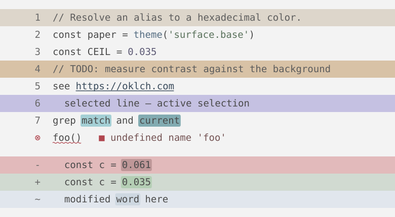
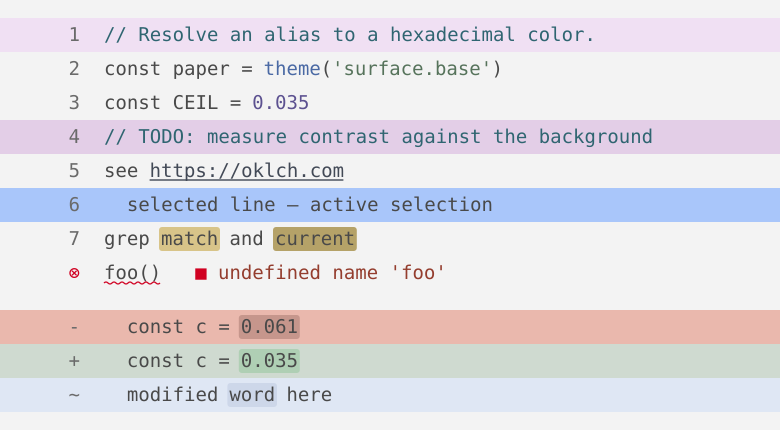

# Themes

| Ergo Light | TE calm |
| --- | --- |
|  |  |
| [`ergo-light.tokens.json`](ergo-light.tokens.json): neutral backgrounds and accents with low chroma | [`te-calm.tokens.json`](te-calm.tokens.json): Teenage Engineering-inspired, gray backgrounds, high chroma for error marks |

Only one theme is active at a time. Switch with `bb -m generate --theme <name>`.
The generator stores the selected theme in `theme/.active`.
Git ignores this file.
`install.sh` uses the stored selection to regenerate the same theme.
Each theme has its own `preview-<name>.svg`.
A change of active theme does not change these tracked files.

## Structure

Each `*.tokens.json` file defines the colors as [design tokens](https://tr.designtokens.org/) in two layers:

- **Primitives:** OKLCH color scales.
- **Semantic tokens:** named roles that refer to primitives, such as `syntax.string`, `diff.add`, and `status.error`.

Both files define the same semantic tokens. Each file describes its own values, so you can read one theme without the other.

### Token groups

| Group | Kind | Use it for |
| --- | --- | --- |
| `surface` | background | Editor, bar, popup, and current-line backgrounds; the active-tab keycap |
| `border` | foreground | Separators, borders, and indent guides |
| `text` | foreground | Interface and body text; `text.accent` for interface elements that need a color |
| `syntax` | foreground | Code only. Interface elements never use these |
| `status` | foreground | Diagnostics, Git signs, and success or failure states |
| `signal` | foreground | Small attention marks: unsaved buffer, macro recording, bell |
| `selection` | background | Selections, the selected entry in menus and lists, matching brackets and references |
| `search` | background | Search matches and jump labels |
| `comment`, `doc` | mixed | Code comments, documentation, and Markdown |
| `diff` | background | Added, changed, and deleted lines and words |
| `cursor` | background | Cursor blocks |
| `mode` | background | The mode keycap in the status line |
| `terminal` | foreground | The 16 ANSI colors |

Most groups contain only foregrounds or only backgrounds.
In the mixed groups, `fg` and `bg` name the main pair, and other backgrounds end in `Bg`, such as `doc.quoteBg`.

Tools do not read the tokens directly. Each generator converts semantic tokens to the format for its tool:

| Tool | Generator |
| --- | --- |
| Neovim | [`generators/nvim.clj`](generators/nvim.clj) |
| WezTerm | [`generators/wezterm.clj`](generators/wezterm.clj) |
| Zellij | [`generators/zellij.clj`](generators/zellij.clj) |
| delta | [`generators/delta.clj`](generators/delta.clj) |
| Helix | [`generators/helix.clj`](generators/helix.clj) |

`adapters` in [`generate.clj`](generate.clj) lists the output path of each generated file.

The generator uses the name `baked` for each output file and its theme name.
The name does not depend on the active theme.
Thus, the tool configuration does not change when you change themes.

Git ignores the generated files (`packages/**/baked*`). `install.sh` regenerates them on each run.
The generator also creates one `preview-<name>.svg` for each theme. Git tracks these files so GitHub can display them.
Do not edit generated files manually.

ccstatusline, Starship, and Git output use named ANSI colors from the terminal palette.
They use the terminal colors and do not need separate generated files.

### Source files

- [`engine.clj`](engine.clj) resolves token references into the `theme` function, for example `(theme "surface.base")`.
  It also validates the contract between tokens and generators.
- [`generators/`](generators/) contains one namespace for each tool. Each provides a `render` function.
  `preview.clj` is separate from `adapters` so preview-only references do not hide tokens that no tool generator references.
- [`generate.clj`](generate.clj) registers tool generators in `adapters`, selects the theme, validates the contract, and writes all output files.

## Change the theme

Edit a token file.
Then run these commands from the repository root:

```sh
# Install Babashka. Do this one time.
(cd theme && mise install)

# Generate all output files for te-calm. This also selects te-calm.
(cd theme && bb -m generate --theme te-calm)

# Regenerate the active theme. install.sh also runs this command.
(cd theme && bb -m generate)

# Show a 24-bit color preview in the terminal. This does not write files.
(cd theme && bb -m generate --preview)
(cd theme && bb -m generate --preview --theme te-calm)  # Preview te-calm. Keep the active theme.

# Generate the files. Then validate the token references and output for all themes.
(cd theme && bb -m generate && bb test)
```

Reload each tool to apply the new colors. In Neovim, run `:BakedReload`.

The terminal preview and the `preview-<name>.svg` images use the same sample definition.
Use `--preview` through SSH or in a Neovim `:terminal` window.
Examine the changes before you reload the tools.
Use a terminal with 24-bit color support, such as WezTerm, kitty, or a recent tmux version.
The error mark uses a curved underline in WezTerm and kitty, and a straight underline elsewhere.

## Add a tool

1. Create `generators/<tool>.clj` with a `render` function.
2. Add the generator and its output path to `adapters` in `generate.clj`. Start the file name with `baked` so Git ignores it.
3. Run the generation and test commands above.

No changes to `engine.clj` are needed.
The contract test finds missing token references and tokens that no generator references.
