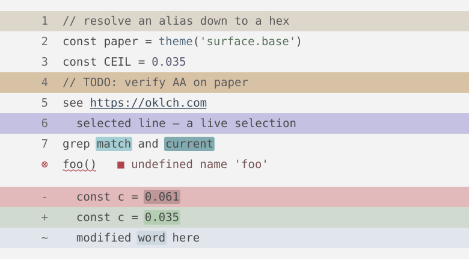
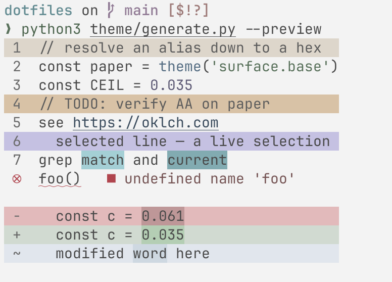

# Ergo Light theme



## How it works

[`ergo-light.tokens.json`](ergo-light.tokens.json) defines the colors as [design tokens](https://tr.designtokens.org/) in two layers:

- **Primitives:** OKLCH color scales.
- **Semantic tokens:** named roles that refer to primitives, such as `accent.string`, `diff.add`, and `status.error`.

Tools do not read the tokens directly. Each generator converts semantic tokens to the format for its tool:

| Tool | Generator | Generated file |
| --- | --- | --- |
| Neovim | [`generators/nvim.clj`](generators/nvim.clj) | `colorschemes/ergo_light_palette.lua` |
| WezTerm | [`generators/wezterm.clj`](generators/wezterm.clj) | `colors/ergo_light.toml` |
| Zellij | [`generators/zellij.clj`](generators/zellij.clj) | `themes/ergo-light.kdl` |
| delta | [`generators/delta.clj`](generators/delta.clj) | `delta/ergo-light.gitconfig` |
| Helix | [`generators/helix.clj`](generators/helix.clj) | `themes/ergo_light.toml` |

Git ignores these five files. `install.sh` regenerates them on each run.
The generator also creates `preview.svg`. Git tracks this file so GitHub can display it.
Do not edit generated files manually.

ccstatusline, Starship, and Git output use named ANSI colors from the terminal palette.
They follow the theme without separate generated files.

### Source files

- [`engine.clj`](engine.clj) resolves token references into the `theme` function, for example `(theme "surface.base")`.
  It also validates the contract between tokens and generators.
- [`generators/`](generators/) contains one namespace per tool. Each provides a `render` function.
  `preview.clj` is separate from `adapters` so preview-only references do not hide unused tool tokens.
- [`generate.clj`](generate.clj) registers tool generators in `adapters`, validates the contract, and writes all output files.

## Change the theme

Edit the token file, then run these commands from the repository root:

```sh
# Regenerate all output files. install.sh also runs this command.
(cd theme && bb -m generate)

# Show a 24-bit color preview in the terminal without writing files.
(cd theme && bb -m generate --preview)

# Validate token references and compare generated output with expected output.
(cd theme && bb -m generate && bb test)
```

Reload each tool to apply the new colors.

The terminal preview and `preview.svg` use the same sample definition.
Use `--preview` over SSH or in a Neovim `:terminal` window to inspect changes before reloading tools.
Use a terminal with 24-bit color support, such as WezTerm, kitty, or a recent tmux version.
The error mark uses a curved underline in WezTerm and kitty, and a straight underline elsewhere.



This screenshot does not update automatically. Replace it after major theme changes.

## Add a tool

1. Create `generators/<tool>.clj` with a `render` function.
2. Add the generator to `adapters` in `generate.clj`.
3. Add its output path to `.gitignore`.
4. Run the generation and test commands above.

No changes to `engine.clj` are needed.
The contract test checks for missing token references and unused tokens.
